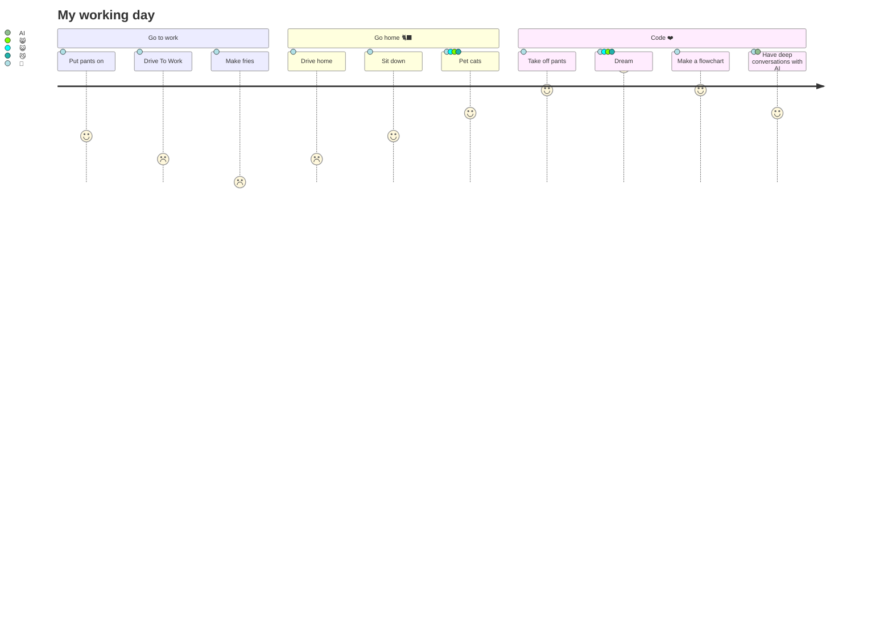

<div style="border: 1px solid white;border-radius: 6em;">


## Introduction 🤝

<table>
<tr>   
<td> 
<h3 align="center">

</h3> 
</td>
<td align="center" colspan="2"> 

| Table Of Contents 📑 |
| --- |
|[Introduction](#introduction-)|
|[A Few Bytes About Me](#-a-few-bytes-about-myself)|
|[Development Environment](#-my-development-environment)|
|[Tech Stack](#-some-tech-ive-begun-to-become-familiar-with-)|
|[GitHub Activity](#--my-github-activity-)|

</td>
</tr>
<tr>
<td colspan="2" align="center">


</td>
<td>
     
     <a href="https://github.com/ryo-ma/github-profile-trophy"></a>
</td>
</tr>
<tr>
<td colspan="3">

</td>
</tr>
</table>

## 👨 A Few Bytes About Myself
     
```json 
PhobiaCide: {
  name: "PhobiaCide",
  location: {
    city: "Little Rock,
    state: "Arkansas",
    country: "USA"
  },
  occupation: "Line Cook"
  company: "Incomplete Infinity",
  education: [
    "Self-Taught Developer and Designer"
  ],
  fields_of_interest: [
    "Web Development",
    "Data Science",
    "Machine Learning",
    "UI/UX",
    "Game Development",
    "DevOps"
  ],
  technical_background: [
    "Plays Eve Online",
    "Lifelong computer enthusiast/hobbyist"
  ],
  currently_learning: [
    "Halfmoon.css",
    "javascript",
    "Topcoat.css",
    "Bootstrap.js",
    "Popper.js",
    "jQuery.js",
    "d3.js"
  ],
  goals_2024: [
    "Create at least 5 finished Projects",
    "Learn at least 3 new Technologies.",
    "Be excellent!"
  ],
  hobbies: [
    "Gaming",
    "Cinema",
    "Comedy",
    "Food",
    "Math",
    "Art"
  ],
  books: [
    {
      title: "Slaughterhouse-5",
      author: "Kurt Vonnegut"
    }, {
      title: "Fight Club",
      author: "Chuck Palahniuk"
    }, {
      title: "1984",
      author: "George Orwell"
    }, {
      title: "Brave New World",
      author: "Aldous Huxley"
    }
  ],
  movies: [
    "Cloud Atlas"
  ]
} 
```

## My Dev Cycle



## 💻 My Development Environment
<br>
<table>
<tr>
<td>
<table>
  <tr>
    <td align="right"> OS: </td>
    <td>
      
    </td>
  </tr>
  <tr>
    <td align="right"> Cloud: </td>
    <td>
      
    </td>
  </tr>
</table>
</td>
<td>
<table>
  <tr>
    <td align="right"> IDE: </td>
    <td>
      
    </td>
  </tr>
  <tr>
    <td align="right"> Linter: </td>
    <td>
      
    </td>
  </tr>
</table>
</td>
</tr>
</table>
<br>
<br>
<h2> Some Tech I've Begun To Become Familiar With: </h2>
<br>

|     |
| --- | 
||
||
||
||
||
  
<table>
  <tr>
    <td>
      
    </td>
    <td>
      
    </td>
    <td>
      
    </td>
    <td>
      
    </td>
    <td>
      
    </td>
    <td>
      
    </td>
    <td>
      
    </td>
  </tr>
  <tr>
    <td>
      
    </td>
    <td>
      
    </td>
    <td>
      
    </td>
    <td>
      
    </td>
    <td>
      
    </td>
    <td>
      
    </td>
    <td>
      
    </td>
  </tr>
</table>
<br>
<h2> 📈 My GitHub Activity </h2>
<br>
<div align="center">
  <table>
    <tr>         
      <td>
        
      </td>   
      <td>
        
          <a href="https://github.com/ryo-ma/github-profile-trophy"></a>
      </td>
    </tr>
  </table>
</div>
<hr>

</div>
